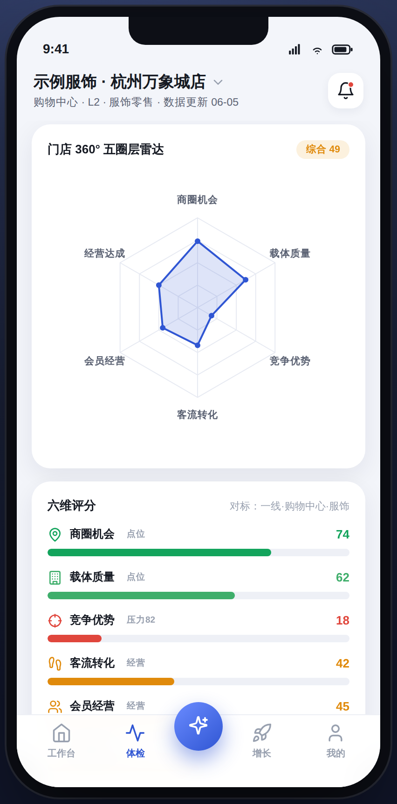
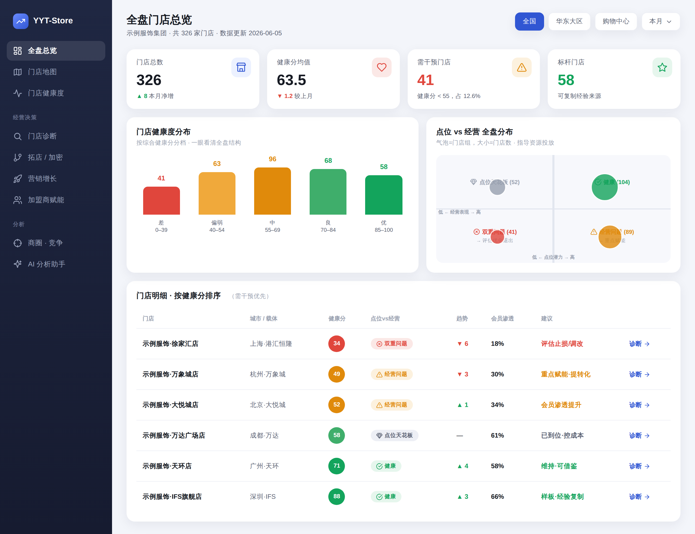

# 05 · 产品功能与模块规划

功能围绕 [门店 360° 模型](03-门店多维分析模型.md) 与 [使用场景](02-目标用户与使用场景.md) 组织。原则：**结论先行、按角色呈现、移动端可用**。

## 5.1 功能地图

```
YYT-Store
├── A. 门店工作台（移动端首页 · 店长/加盟商高频入口）
│     健康分 · AI 一句话诊断 · 今日/本周关键变化 · 待办建议 · 预警
├── B. 门店体检与诊断
│     五圈层雷达 · 健康度评分 · AI 归因 · 点位vs经营判断
├── C. 商圈分析
│     商圈界定 · 人口/消费画像 · 能级与趋势 · 供需缺口
├── D. 载体分析（商场/街区）
│     整场客流 · 业态组合 · 位置质量 · 出租率 · 同场竞品
├── E. 竞争监测
│     竞品地图 · 同业态饱和度 · 竞品动态 · 开关店预警
├── F. 会员与潜客（中期）
│     RFM 分层 · 复购/流失 · 潜客池 · 触达建议
├── G. 经营整合分析（后期）
│     销售/坪效/品类 · 内外交叉归因 · 同店对标
├── H. 决策建议中心
│     调改建议 · 续约/止损评估 · 拓店选址/加密蚕食评估 · 效果回收
├── I. 集团/加盟商驾驶舱（Web 为主）
│     门店健康度地图 · 排序分层 · 区域/商圈布局 · 加盟商赋能
├── J. AI 助手（贯穿全局）
│     对话问数 · 自动诊断报告 · 主动洞察推送
├── K. 增长营销行动中心（中后期）
│     定向营销区域 · 潜客精准营销 · 会员召回/激活/拉新 · 自动化营销
└── L. 外部事件与客流预测（执行层 · 外部数据）
      商场/周边活动预告 · 天气预警 · 客流影响预测 · AI 联动经营建议
```

---

## 5.2 模块详述（按上线优先级）

### A. 门店工作台（Phase 0，移动端核心）
店长/加盟商打开即见：
- **综合健康分** + 趋势 + **数据完整度**（随三层数据递进而提升，见 [04](04-数据体系与精度演进.md)）；
- **AI 一句话诊断（问题 → 建议 → 结论）**：「点位是好的，问题在经营：转化率低于同类店，建议优化进店引导」；
- **本周外部影响（活动 / 天气 → 客流预测）**（第 ① 层能力，零接入门槛，见模块 L）；
- 会员 / 经营概览（未接入则「上传解锁」），**待办建议** 与 **预警**。
> 这是产品的「脸」，决定店长是否每天打开。工作台随数据三层递进逐层解锁的形态见 [04.2 截图](04-数据体系与精度演进.md)。

### B. 门店体检与诊断（Phase 0–1）
- 五圈层雷达图 + 各项评分；
- **AI 归因**：把涨跌按「大盘/商圈（外因）→ 竞争 → 自身（内因）」拆解占比；
- **点位 vs 经营 判断**：用客群盘子 × 渗透/转化的 2×2 矩阵，判断"是点位问题还是经营问题、值不值得继续跟进"（方法见 [03.10](03-门店多维分析模型.md)）；
- 一键生成《门店诊断报告》（可分享给加盟商/总部）。

<p style="text-align:center"></p>

### C. 商圈分析（Phase 0）
- 动态商圈界定（等时圈 + 客流来源）；
- 人口/消费/客群画像；商圈能级与趋势；供需缺口识别。

### D. 载体分析（Phase 0–1）
- 购物中心：整场客流、业态组合、位置质量、出租率、同场竞品；
- 街区（后期）：街道人流、沿街位置、临铺业态。

### E. 竞争监测（Phase 0–1）
- 竞品地图与距离；同业态饱和度（红海/蓝海）；竞品动态与开关店预警。

### F. 会员与潜客（Phase 1–2）
- **RFM 分层**、复购/流失诊断、生命周期价值；
- **会员画像**（会员数据 × 第三方数据对接增强）：性别/年龄/消费力/偏好标签；
- **客群来源地分布**（LBS 居住/工作地）：距离分档（≤1km / 1–3km / …）与 Top 来源地（写字楼 / 住宅 / 通勤枢纽）；
- **潜客机会与场景关联**：结合画像匹配，识别高潜小区 / 写字楼 / 通勤等关联场景并估算潜客规模，给出定向触达与异业联动建议；
- 商圈潜客池识别与触达建议（衔接 [K 增长营销](#k-增长营销行动中心phase-13从分析到行动)）。

> **数据归属：第 ② 层（会员数据）**——会员数据接入后解锁（见 [04 产品主线](04-数据体系与精度演进.md)）。原型落地（截图见 [03.2](03-门店多维分析模型.md)）：会员画像 → 客群来源地分布 → 潜客机会与场景关联 → 一键圈人。

### G. 经营整合分析（Phase 2）
- 销售/坪效/客单/连带/品类动销；
- **内外交叉**：把经营表现放进商圈/竞争背景里看（如「坪效低，但商圈消费力本就有限，已属合理区间」）；
- 同店/同类店对标。

### H. 决策建议中心（Phase 1–3，价值高地）
- **调改建议**：品类/时段/陈列/会员动作，附可比案例佐证；
- **续约/止损评估**：点位价值评分 + 续约/调改/关店建议 + 租金谈判依据；
- **拓店选址评估**（**Phase 1，仅需外部数据**）：复用商圈/竞争模型为新点位打分，属第 ① 层能力，可较早交付；
- **加密/蚕食评估**（**Phase 2，需自有门店分布 + 会员/客流重叠**）：区域内自有同类店是否分流，给"还能加密 / 已饱和"结论（方法见 [03.11](03-门店多维分析模型.md)）；
- **效果回收**：调整后跟踪效果，反哺模型。

### I. 集团/加盟商驾驶舱（Phase 1–2，Web 为主，**管理端**）
- 全国/区域门店健康度地图与分布；
- 按健康分排序分层：样板店 / 需干预店 / 建议优化退出店；
- 调改/拓店决策（见模块 H，截图见 [12](12-角色体系与权限.md)）；加盟商赋能：批量诊断、统一标准、下发建议。

<p style="text-align:center"></p>

### J. AI 助手（Phase 0 起，贯穿）
详见 [06 技术架构](06-技术架构.md)。三种形态：
- **对话问数**：「我这家店周末客流为什么跌？」
- **自动诊断报告**：定期/触发式生成；
- **主动洞察推送**：发现异常/机会主动提醒。

### K. 增长营销行动中心（Phase 1–3，从分析到行动）
把诊断结论转化为可执行的增长动作（详见 [11 增长行动](11-增长行动.md)）：
- **线下定向营销区域**：找出值得投放的高潜网格，输出投放优先级热力地图（可较早上线，依赖外部数据）；
- **潜客精准营销**：潜客池识别、分层、差异化触达建议；
- **会员召回/激活/拉新**：按生命周期给人群包 + 策略建议；
- **自动化营销**（后期）：人群圈选→触点编排→效果回收的自动闭环，结合 AI Agent 与[行业大脑](08-行业大脑对接.md)。

> **两端形态不同**（见 [12 管理端 vs 执行端](12-角色体系与权限.md)）：**执行端**店长只看「该触达谁、推什么」的轻量动作建议与一键人群包；**管理端**营销团队做跨店人群圈选、活动编排与效果回收的重运营。同一能力、两套界面深度。
监测会影响门店客流的**外部事件**、预测影响并给出联动建议——**纯外部数据、无需客户上传**，是执行端冷启动即可交付价值的能力：
- **活动监测与预告**：本商场活动、同场其他门店、周边商场的促销/活动（含未来预告，频次高）；
- **天气预警**：调用天气数据，预警未来数日的客流波动；
- **客流影响预测**：量化预估各事件对到店客流的影响（如周年庆 +25%、暴雨 -15%）；
- **AI 联动经营建议**：提示门店借势/避险（高峰加推连带、雨天留客与线上承接）。

> 决策者关心调改（管理端），店长更需要这种「下周会发生什么、我该怎么应对」的执行帮助（见 [12 管理端 vs 执行端](12-角色体系与权限.md)）。

---

## 5.3 角色化的产品形态

| 角色 | 主形态 | 核心模块 |
|------|--------|----------|
| 店长 | 移动 App / 小程序 | A 工作台、B 诊断、J AI 助手 |
| 加盟商 | 移动 + 轻 Web | A、B、H 决策建议、I 多店驾驶舱（小） |
| 集团 | Web 驾驶舱 + 移动概览 | I 驾驶舱、H 决策、全模块 |

> 同一套数据与模型，三套「壳」。优先打磨店长移动端（高频、口碑入口），再向上做加盟商/集团的聚合视图。

> ⚠️ **注意**：上表是简化的三层概览。实际上集团/加盟商各含多个角色（拓展、营运、营销、招商、区域分公司、加盟商老板/店长/运营等），加上外部「潜在加盟客户」，每个角色是「共享能力模块 + 数据范围权限 + 角色输出模板」的组合。**完整的角色工作台与权限设计见 [12 角色体系与权限](12-角色体系与权限.md)**——这意味着上文 A–K 能力模块是"零件"，角色工作台才是"成品"。

---

## 5.4 功能与阶段对照（速查）

| 模块 | Phase 0 | Phase 1 | Phase 2 | Phase 3 |
|------|:------:|:------:|:------:|:------:|
| A 工作台 | ●基础 | ●增强 | ● | ● |
| B 体检诊断 | ●基础 | ●AI归因 | ● | ● |
| C 商圈 | ● | ● | ●街铺 | ● |
| D 载体 | ●Mall | ● | ●街区 | ● |
| E 竞争 | ●基础 | ●预警 | ● | ● |
| F 会员潜客 | – | ● | ● | ● |
| G 经营整合 | – | – | ● | ● |
| H 决策建议 | – | ●续约/调改/**选址** | ●**加密蚕食** | ●闭环 |
| I 集团驾驶舱 | – | ● | ● | ● |
| J AI 助手 | ●问数/报告 | ●归因 | ●建议 | ●Agent |
| K 增长营销 | – | ●定向/召回/拉新 | ●潜客精准 | ●自动化 |
