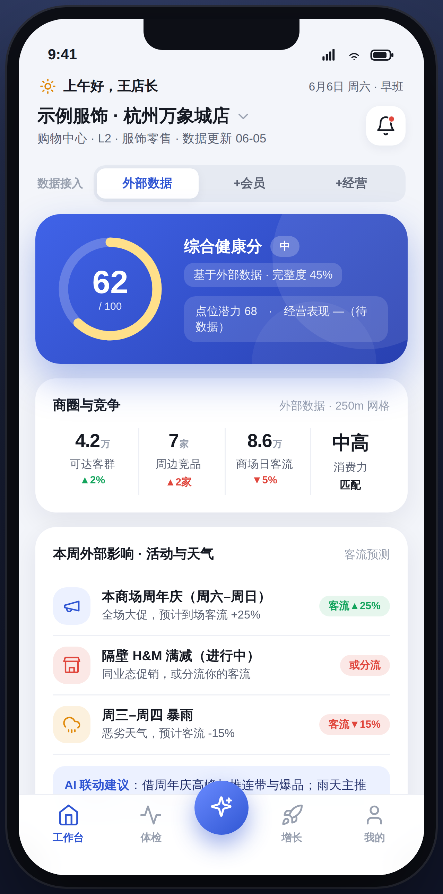
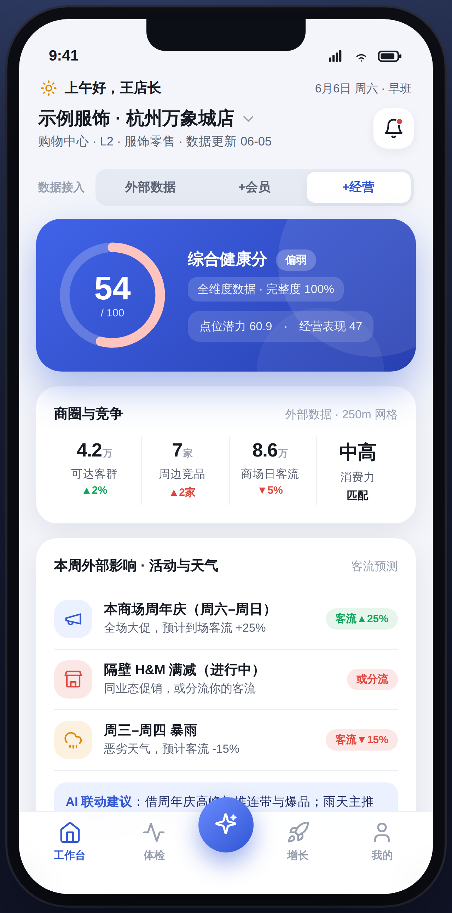
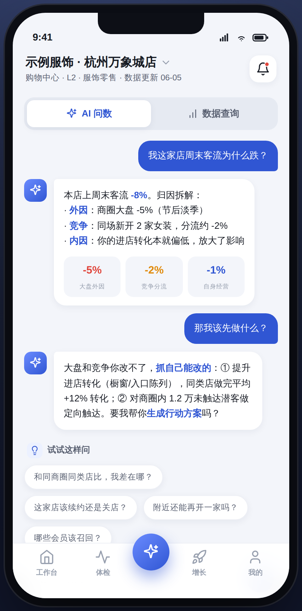
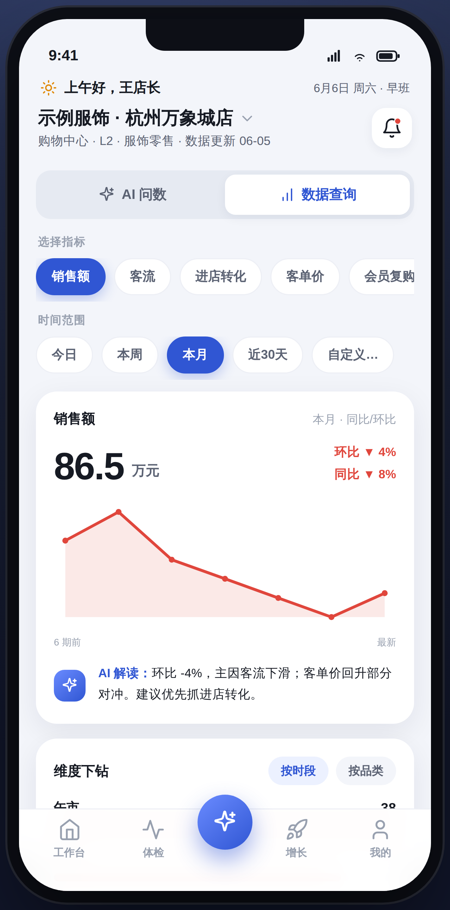
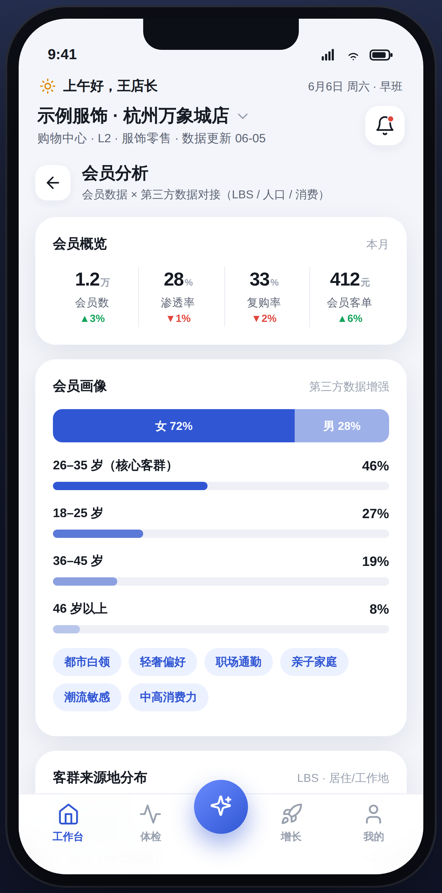
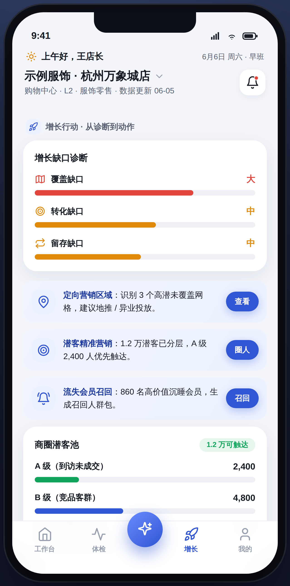
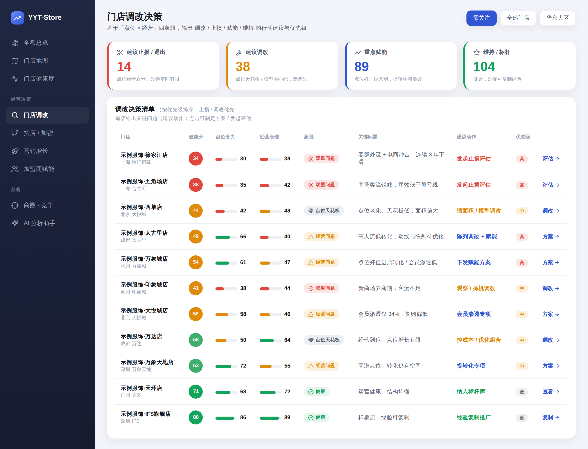
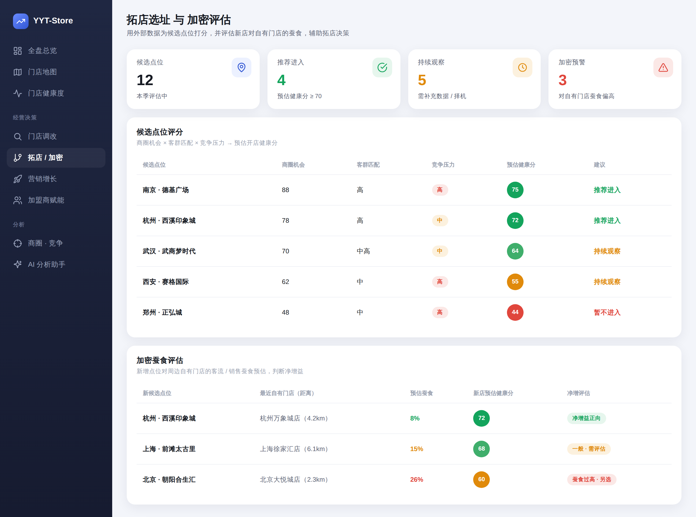

# 15 · 产品原型（高保真示意）

本篇汇总可点击原型的关键界面截图，对应 [12 角色体系](12-角色体系与权限.md) 的「**管理端 vs 执行端**」两套产品形态。原型源码见 `prototype/`（`index.html` 执行端、`dashboard.html` 管理端），为示意数据，用于演示交互与信息架构。

---

## 15.1 执行端（移动 · 店长 / 加盟商）

定位「经营 / 动作」：结论先行、AI 优先、外部事件提醒，强调**今天/本周该做什么**。

### 工作台 · 数据成熟度逐层解锁

体现 [04 数据体系](04-数据体系与精度演进.md) 的核心逻辑：早期**只有外部数据**，会员/经营数据未接入时不臆造，显示「上传/录入解锁」与「帮我对接 · 增值」；接入后健康分与经营表现逐层补齐。顶部「数据接入」切换演示由外到内。

> 左：仅外部数据（完整度 45%、经营表现「待数据」、会员/经营概览「上传解锁」）；右：+经营数据解锁后（完整度 100%、经营表现补齐）。
> 工作台前部「**本周外部影响 · 活动与天气**」为执行层高价值能力：本商场/周边活动预告 + 天气 → 客流影响预测 → AI 联动建议（纯外部数据、零接入门槛，见 [05 模块 L](05-产品功能与模块规划.md)）。

### 门店体检 · AI 问数 · 数据查询

> 体检：五圈层雷达 + 六维评分 + 点位 vs 经营矩阵（方法见 [03.10](03-门店多维分析模型.md)、[14](14-健康度评分设计.md)）。AI 问数与数据查询贯穿全局（[06 技术架构](06-技术架构.md)）。

### 会员分析（会员数据 × 第三方数据）

对应 [05 模块 F](05-产品功能与模块规划.md)：会员画像 → 客群来源地分布 → 潜客机会与场景关联 → 一键圈人。

> 左：会员分析（画像、LBS 来源地分布、高潜小区/写字楼/通勤场景 + AI 定向触达建议）；右：增长行动（缺口诊断 + 潜客池分层 + 召回，见 [11 增长行动](11-增长行动.md)）。

---

## 15.2 管理端（Web · 集团 / 区域）

定位「决策 / 督导」：跨店聚合、对标、趋势，强调**门店要不要调改/止损/拓店/加密**。侧边栏切换视图。

### 全盘总览

> 健康度分布 + 点位 vs 经营全盘分布 + 门店明细排序（需干预优先）。

### 门店调改决策

按「点位 × 经营」四象限给出 **止损 / 调改 / 赋能 / 维持** 分桶与决策清单（关键问题 → 建议动作 → 优先级），对应 [05 模块 H](05-产品功能与模块规划.md)、[03.10](03-门店多维分析模型.md)。

### 拓店选址 与 加密评估

外部数据为候选点位打分（商圈 × 客群 × 竞争 → 预估健康分），并评估新店对自有门店的**蚕食净增益**，对应 [03.11](03-门店多维分析模型.md)、[05 模块 H](05-产品功能与模块规划.md)。

---

> 截图均为示意数据（示例服饰集团 · 杭州万象城店等）。原型已与后端评分引擎（FastAPI）打通，`http(s)` 下展示实时计算结果，`file://` 下回退本地示例数据。
